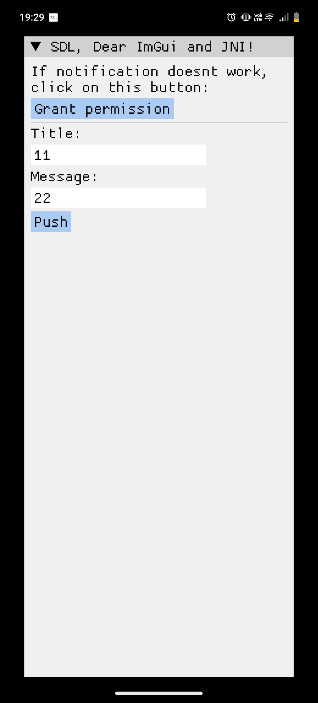
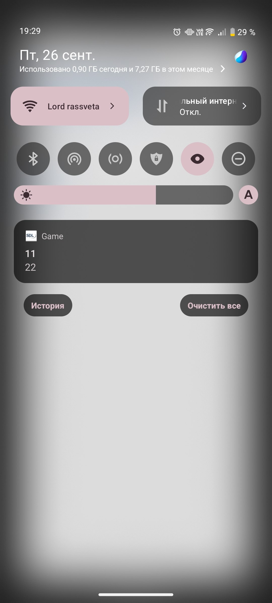
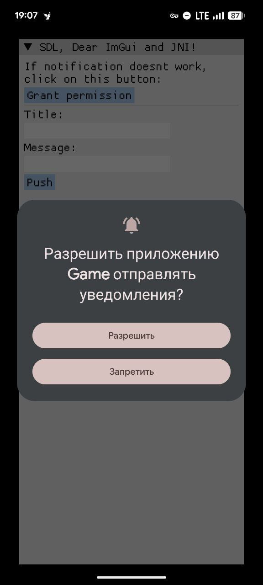

В последние дни я стал изучать JNI, даже путем не зная Java.

Для чего?

Я планирую разрабатывать приложения для Android, используя SDL библиотеку на C++ или egui на Rust и вот, в SDL не было нужных мне функций, а именно:
* Запрос на полный доступ к хранилищу с Android 11 (до этой версии Android можно было спокойно дергать простой запрос права на чтение хранилища. Да, Google Play такое не любит, однако пока я не хочу возиться с Storage Access Framework, да и регистрировать сам Google аккаунт в сторе);
* Уведомления;
* Получить путь к основной папке пользователя;

Хоть я еще точно не определился на каком ЯП писать, JNI понимать мне уж точно не помешает.

В рамках данного полотна текста расскажу про то, как сделать простые уведомления для SDL, остальное пока оставлю на будущее. Будем использовать сам SDL, Dear ImGui для простого UI, пару патчей для SDL Android Project и собственно JNI. Данное полотно текста подразумевает, что вы хоть как-то понимаете программирование и делали поделки на C++ с использованием Cmake, я тут не буду писать конфиг сборки для Cmake, если вам лень самому, можете просто использовать готовый пример [здесь](https://github.com/shortice/SDL-Jni).

Собственно, что такое JNI сказано на 100 сайтах, я не буду ничего говорить, не рассматривайте это как руководство для JNI, если нужно больше деталей, рассматривайте другие ресурсы, лично я читал на сайте Oracle, а именно [здесь](https://docs.oracle.com/javase/8/docs/technotes/guides/jni/spec/jniTOC.html). Я расскажу свой кейс и покажу, включая исходный код, как я сделал эти функции. Да, там не идеально. Да, там нужно будет доработать пару моментов, но на мой взгляд, я хорошо постарался для первого раза.

Первое, что я сделал это посмотрел, а как в SDL вообще работает JNI. Наткнулся на вот такой кусок кода [здесь](https://wiki.libsdl.org/SDL3/SDL_GetAndroidJNIEnv#code-examples).
```cpp
#include <SDL3/SDL.h>
#include <jni.h>

// This example requires C++ and a custom Java method named "void showHome()"

// Calls the void showHome() method of the Java instance of the activity.
void showHome(void)
{
    // retrieve the JNI environment.
    JNIEnv* env = (JNIEnv*)SDL_GetAndroidJNIEnv();

    // retrieve the Java instance of the SDLActivity
    jobject activity = (jobject)SDL_GetAndroidActivity();

    // find the Java class of the activity. It should be SDLActivity or a subclass of it.
    jclass clazz(env->GetObjectClass(activity));

    // find the identifier of the method to call
    jmethodID method_id = env->GetMethodID(clazz, "showHome", "()V");

    // effectively call the Java method
    env->CallVoidMethod(activity, method_id);

    // clean up the local references.
    env->DeleteLocalRef(activity);
    env->DeleteLocalRef(clazz);

    // Warning (and discussion of implementation details of SDL for Android):
    // Local references are automatically deleted if a native function called
    // from Java side returns. For SDL this native function is main() itself.
    // Therefore references need to be manually deleted because otherwise the
    // references will first be cleaned if main() returns (application exit).
}
```
Достаточно сообразить и понять, что из себя представляет JNI:
* Есть `JNIEnv`, собственно штука через которую мы будем вызывать функции JNI;
* В Java все классы наследуются от класса `java/lang/Object`, здесь он представлен как `jclass` (просто класс, **не объект**) и `jobject` (соотв. объект);
* `GetObjectClass` используется, чтобы получить `jclass` из объекта (в данном случае нативное андроид активити SDL), чтобы потом уже получить `jmethodID` (как понимаю ID метода того или иного класса);
* Для вызова функций Java из C++ есть функции типа `CallXMethod`. X в данном случае КАК вызывать метод. Он принимает `jclass` и `methodID`, а также аргументы (которые должны быть представлены в `jobject`) в виде C++ шаблона с произвольной длиной;
* DeleteLocalRef. Дело в том, что в JNI ты управляешь памятью самостоятельно. А значить нужно очищать ссылки объектов JNI;

Так вот. Чтобы правильно вызывать методы, нужно понимать сигнатуры JNI.
Рассмотрим вот эту строку:
```java
jmethodID method_id = env->GetMethodID(clazz, "showHome", "()V");
```
`()V` - это сигнатура JNI метода. `()` - значит, что метод не принимает аргументов, `V` - метод ничего не возвращает (void). clazz в данном случае класс Java (jclass), jobject здесь не нужен.

Если нужно больше информации про JNI, то как я говорил выше, лучше рассматривайте [этот](https://docs.oracle.com/javase/8/docs/technotes/guides/jni/spec/jniTOC.html) сайт.

А мы начнем делать модификации для Java проекта, прежде чем начать писать код для JNI.

Убедитесь, что вы скачали Android JDK, NDK и SDL, а также вытащили из SDL папку `android-project`, мы будем работать только в этой папке.

А теперь, приступим:
* Открываем папку `app/src/main/java/<...>/app`;
* Открываем файл SDLAcitivity.java;
* Добавим следующие Java импорты:
```java
import android.os.Environment;
import android.provider.Settings;
import android.app.*;
import android.app.NotificationManager;
```
* Сделаем собственно наш метод для уведомлений:
```java
public class SDLActivity
    extends Activity
    implements View.OnSystemUiVisibilityChangeListener {

	  /*
	  Для новых версий Android требуется создание каналов для уведомлений.
	  Подробнее об этом в ссылке ниже.
	  */
    private void createNotificationChannel() {
        // https://developer.android.com/develop/ui/views/notifications#ManageChannels
        if (Build.VERSION.SDK_INT >= Build.VERSION_CODES.O) {
            CharSequence name = "Notifications";
            String description = "All notifications";
            int importance = NotificationManager.IMPORTANCE_DEFAULT;
            NotificationChannel channel = new NotificationChannel(
                "Shortice",
                name,
                importance
            );
            channel.setDescription(description);
            NotificationManager notificationManager = getSystemService(
                NotificationManager.class
            );
            notificationManager.createNotificationChannel(channel);
        }
    }

	  /*
	  Логика создания уведомления.

	  В первом варианте мы должны указывать имя нашего потока уведомлений.
	  */
    private Notification.Builder createNotificationBuilder() {
        if (Build.VERSION.SDK_INT >= Build.VERSION_CODES.O) {
            return new Notification.Builder(getContext(), "Shortice");
        } else {
            return new Notification.Builder(getContext());
        }
    }

	  /*
	  Ох уж этот Android... скорее такой код здесь как норма (проверка версий).
	  Получаем менеджер уведомлений.
	  */
    private NotificationManager getNotificationManager() {
        if (Build.VERSION.SDK_INT >= Build.VERSION_CODES.M) {
            return getSystemService(NotificationManager.class);
        } else {
            return (NotificationManager) getSystemService(
                Context.NOTIFICATION_SERVICE
            );
        }
    }

	  /*
	  Собственно функция для отправки уведомления.
	  */
    public void PushNotification(String title, String text) {
        Notification.Builder builder = createNotificationBuilder();

        builder.setSmallIcon(R.drawable.ic_launcher);
        builder.setContentTitle(title);
        builder.setContentText(text);

        NotificationManager notificationManager = getNotificationManager();

        notificationManager.notify(1, builder.build());
    }

    // <...>

    protected void main() {
        // <...>
        createNotificationChannel();
        // <...>
    }
}
```

И вроде бы все, да? Мы сделали же код для уведомлений? А нифига. При попытки компиляции у нас будет ошибка вот здесь:
```java
// <...>
public void PushNotification(String title, String text) {
	// <...>
	builder.setSmallIcon(R.drawable.ic_launcher);
	// <...>
}
// <...>
```
У нас нет папки `drawable` в `src/main/res` и самого ic_launcher в ней. Исправляем. Создаем папку drawable в нужном нам пути и копируем `ic_launcher.png` из `mipmap-mdpi`. Теперь код должен собраться. Однако мы еще не сделали JNI привязки для него!

Но сначала удалим ВСЕ, что находится в папке `app/jni`. Теперь нужно сделать четыре файла в ней:
* android_jni.cpp;
* android_jni.hpp;
* main.cpp (лучше возьмите [здесь](https://github.com/shortice/SDL-Jni));
* CmakeLists.txt (настроите сами или опять же возьмите [здесь](https://github.com/shortice/SDL-Jni));

В android_jni.hpp:
```cpp
#pragma once

void PushNotification(const char* title, const char* text);

```

Напомню, что в начале этого полотна текста я дал объяснение основным структурам и функций JNI, которые тут используются.

В android_jni.cpp:
```cpp
#include "android_jni.hpp"
#include "jni.h"
#include "SDL3/SDL_system.h"

void PushNotification(
    const char* title,
    const char* text
) {
    JNIEnv* env = (JNIEnv*)SDL_GetAndroidJNIEnv();
    jobject activity = (jobject)SDL_GetAndroidActivity();
    jclass activityClass(env->GetObjectClass(activity));

    jmethodID method_id = env->GetMethodID(
        activityClass,
        "PushNotification", // Наш метод, который мы сделали выше
        "(Ljava/lang/String;Ljava/lang/String;)V" // JNI сигнатура функции
        // JAVA вариант: void(String title, String text);
        // JNI:           ^ V  ^Ljava/lang/String;
    );

    // Создаем Java строки
    jstring param1 = env->NewStringUTF(title);
    jstring param2 = env->NewStringUTF(text);

    // Вызываем наш метод уведомлений
    env->CallVoidMethod(
        activity,
        method_id,
        param1,
        param2
    );

    // Очищаем память
    env->DeleteLocalRef(param1);
    env->DeleteLocalRef(param2);
    env->DeleteLocalRef(activity);
    env->DeleteLocalRef(activityClass);
}
```

Добавим еще в AndroidManifest.xml эту строчку для новых версий Android API:
```xml
<uses-permission android:name="android.permission.POST_NOTIFICATIONS"/>
```

Судя по тому, что я прочитал, где-то пишут, что нужно запрашивать это разрешение во время использования приложения, в каких-то сценариях не нужно запрашивать, поэтому я сделал в main.cpp кнопку на запрос данного разрешения.

Напомню, main.cpp и CMakeFiles.txt вы можете взять из репозитория, который я уже не раз тут писал. И очень важное предупреждение, SDL загружает ваш код из вашей внешней .so библиотеки main, убедитесь, что вы в Cmake файле делаете сборку не исполняемого файла, а внешней библиотеки.

Прежде чем вы сами будете настраивать сборку, я сделаю предупреждение. Так как я не знаком с системой сборки Make и ndk, то я ее полностью выпилил из gradle проекта. Не думаю, что кто-то будет расстроен:).

А теперь если вы настроили Cmake сборку, то можете выполнить:
```
./gradlew build
```
Эта команда создаст вам два .apk в папке `app/build/outputs/apk`. Release у меня не устанавливался вообще, поэтому пробуйте сначала Debug.

Или же вы можете подключить Android устройство с режимом отладки и прописать:
```
./gradlew installDebug
```

Это скомпилирует и установит приложение Game с иконкой SDL.

Лень было картинки оптимизировать, извините заранее!
Если вы сделали все правильно и приложение у вас запустилось, у вас должно быть что-то такое:








Собственно все. Если нужен готовый код, то опять повторюсь, забирайте его [тут](https://github.com/shortice/SDL-Jni). Можете также загрузить уже готовый .apk под архитектуры armeabi-v7a и arm64-v8a [здесь](https://github.com/shortice/SDL-Jni/releases). Вирусов нет ;D.
